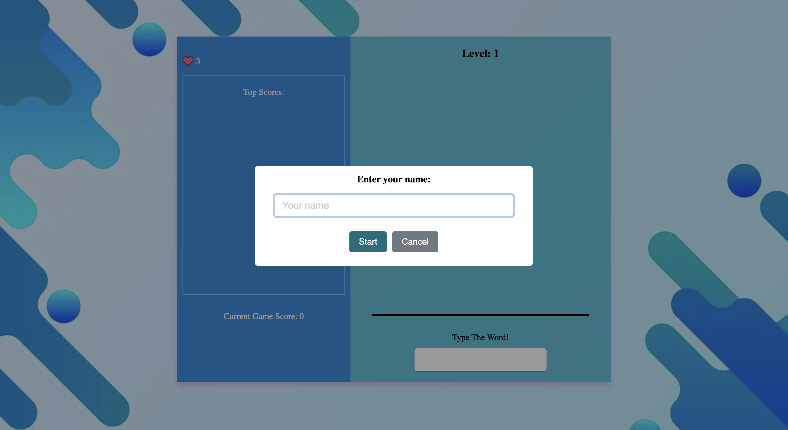

# Word Rain Game




## Description

Word Typing Game is an engaging typing game developed using HTML, CSS, and JavaScript. Words fall from the top of the screen, and players must type them into an input box before they reach the bottom. The game tracks the player's score, lives, and levels, providing an exciting challenge to improve typing speed and accuracy.

## Live Demo
View the live game [here](https://sonia364.github.io/word-rain-game/).

## Features

- Players are prompted to enter their name before starting the game using SweetAlert2.
- Words fall from the top of the screen, and players must type them to score points.
- Tracks and displays the player's score and lives.
- Levels increase as the player successfully types more words, increasing the difficulty.
- Uses SweetAlert2 for enhanced alerts and prompts.

## Getting Started

### Prerequisites

- Web browser (Chrome, Firefox, Safari, etc.)

### Installation

1. Clone the repository:

    ```bash
    git clone https://github.com/Sonia364/word-rain-game.git
    ```

2. Navigate to the project directory:

    ```bash
    cd word-rain-game
    ```

3. Open the `index.html` file in your web browser to play the game.

## Usage

1. Enter your name when prompted using SweetAlert2.
2. Type the falling words into the input box before they reach the bottom.
3. Maintain your lives by typing words correctly.
4. Progress through levels by successfully typing a set number of words.
5. Check your score and compete to reach higher levels.

## Acknowledgements

- Inspired by classic typing games.
- Thanks to the open-source community for providing resources and tools that helped develop this game.

## Contact

Created by [Sonia Nain](mailto:nainsonia92@gmail.com) - feel free to contact me!
